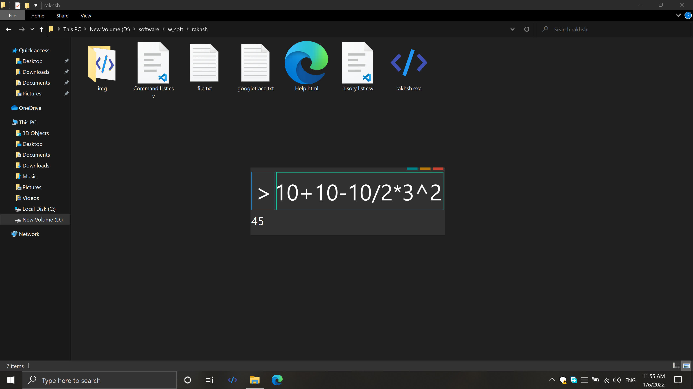
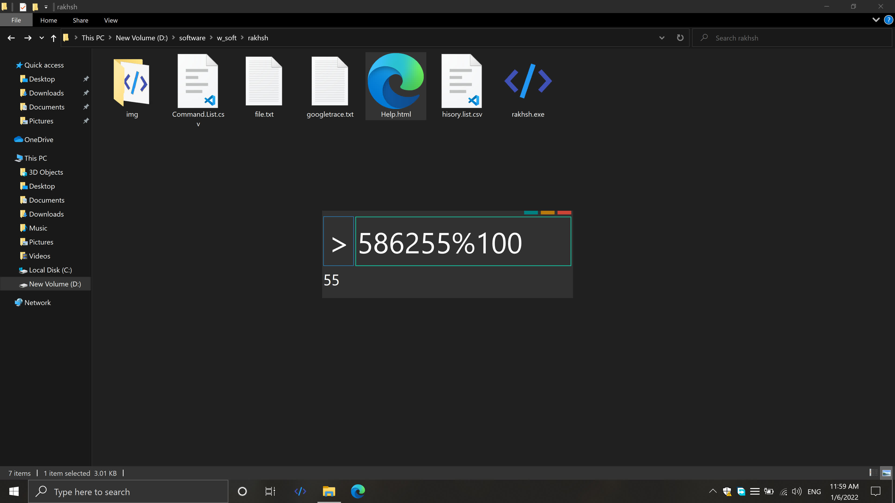
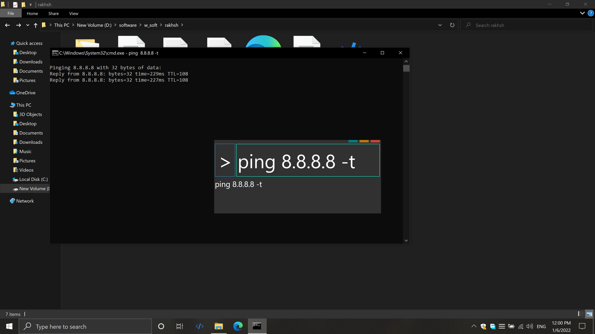
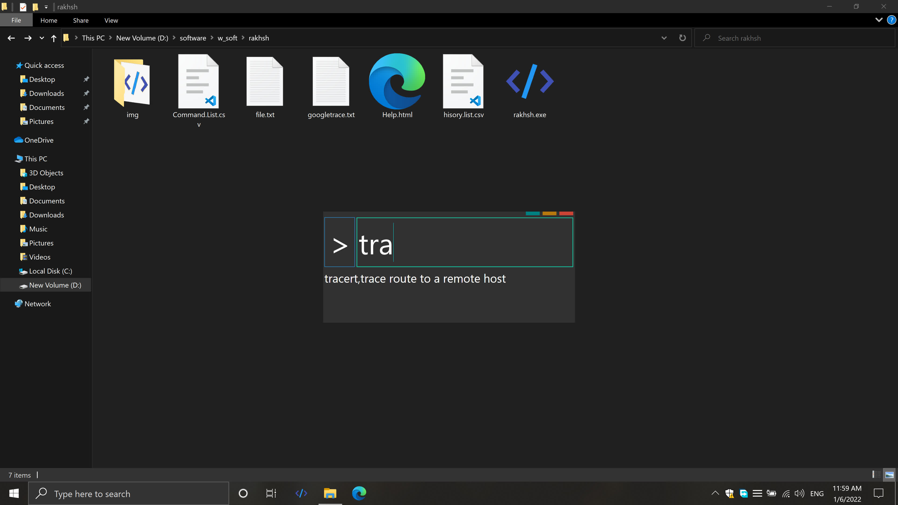
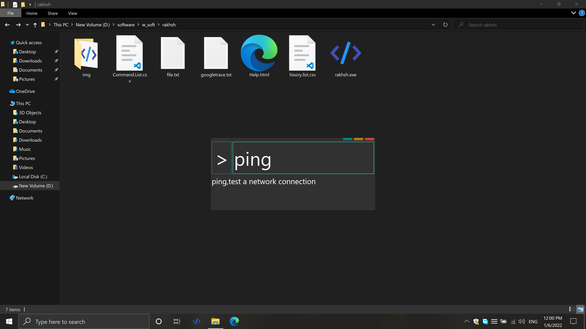
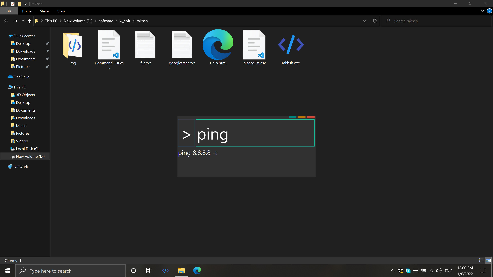

# rakhsh

rakhsh isn't just a calculator, it can run any *CMD* command too!

### calcaulator
while you are typing your math sentense, the result will appear

### Execute Cmd command
you can run any *CMD* command with auto complete and suggest command base on
your command execution.

- suggestion

- auto complete by press `tab`

base on histroy of executed commands

### how to run rakhsh
this repo contain the source and it's built.
so you can go to the built directory and execute the program.
i prefer you to rename the program and add it to start menue.
the program path in this repo is `WpfApplication1/WpfApplication1/bin/Debug/WpfApplication1.exe`

### you need to know

1. **essetial files**

beside the program there is a lot of neccessary files, if you just copy the 
program only, it will crash as soon as you type anything there. thease file 
allways should be togother.

- `hisory.list.csv`
- `Command.List.csv`
- `Command.List.csv`

2. this program was writed for education purpose.

and i was learning programing, so it contain a lots of bugs.

### where the name come from
rakhsh is name of the best frind of rostam who was rescue Iran from the Enemy.
but just in the story, in the read we stucked with the enemys here. Zahak is our supreme leader :`(
